# ClawReel: The AI Short-Video Production Factory

> **从创意到发布，只需一次对话。**
> 这是一个专为 **AI 智能体 (Agents)** 打造的**智能体驱动 / 分段编排式**短视频全链路流水线。

---

## 💡 为什么选择 ClawReel？ (Utility & Value)

### 对于人类创作者 (For Humans: Control & Efficiency)
*   **极致高效**：分钟级生成涵盖 脚本、配音、视频、配图与背景音乐 的高质量短视频。
*   **完全掌控 (HITL)**：拒绝“黑盒同步生成”，每个阶段（脚本、素材、合成）均设有审核点，确保内容符合预期。
*   **成本透明 (FinOps)**：内置资源查重与复用逻辑，通过 `check` 命令智能判定，平均节省 50%-80% 的模型调用成本。

### 对于 AI 智能体 (For Agents: Standard & Reliability)
*   **标准化接口**：全量 CLI 命令支持，输出统一为极其易读的 **JSON** 格式。
*   **安全中断协议**：专为 Agent 优化，主动暴露 Checkpoints，方便智能体在关键步骤请求人类授权。
*   **跨环境部署**：一键安装脚本，自动适配 Claude Code, OpenCode, OpenClaw 等多种环境。

---

## 🔄 工作流概览 (Workflow Overview)

**ClawReel** 将完整的视频创作拆解为 **6 个可独立执行的阶段**，Phase 0 为强制性的零成本资源检查，后续每个阶段均支持 HITL 审核点、断点续作与资源复用。

```mermaid
%%{init: {'theme': 'base', 'themeVariables': {'fontSize': '16px'}}}%%
graph LR
    A["✅ Phase 0\nCheck"] --> B["📝 Phase 1\nScript"]
    B --> C["🔊 Phase 2\nTTS + Align"]
    C --> D["🎨 Phase 3\nAssets"]
    D --> E["🎬 Phase 4\nCompose"]
    E --> F["✨ Phase 5\nPost"]
    F --> G["🚀 Phase 6\nPublish"]

    classDef phase0 fill:#e0e7ff,stroke:#6366f1,stroke-width:2px,color:#333
    classDef phase1 fill:#dbeafe,stroke:#3b82f6,stroke-width:2px,color:#333
    classDef phase2 fill:#dcfce7,stroke:#22c55e,stroke-width:2px,color:#333
    classDef phase3 fill:#fef9c3,stroke:#eab308,stroke-width:2px,color:#333
    classDef phase4 fill:#ffe4e6,stroke:#f43f5e,stroke-width:2px,color:#333
    classDef phase5 fill:#f3e8ff,stroke:#a855f7,stroke-width:2px,color:#333
    classDef phase6 fill:#d1fae5,stroke:#10b981,stroke-width:2px,color:#333

    class A phase0; class B phase1; class C phase2; class D phase3
    class E phase4; class F phase5; class G phase6
```



* **Phase 0 – Check** ⚠️ 必做：零成本扫描现有资源，智能判定生成方案。
* **Phase 1 – Script**：Agent 生成完整口播内容 → `format` 命令格式化，输出标准 JSON。
* **Phase 2 – TTS + Align**：Edge TTS 配音 + 逐词时间戳对齐 → `segments.json`（声音、字幕、画面三同步）。
* **Phase 3 – Assets**：按 `segments.json` 批量生成图片（每句一张，语义相关）。
* **Phase 4 – Compose**：FFmpeg 按精确时长合成（不再均分）。
* **Phase 5 – Post**：FFmpeg SRT 字幕烧录、AIGC 标识。
* **Phase 6 – Publish**：一键发布至抖音、小红书。

---

## 🌟 核心特性

-   **即插即用 CLI**：通过 `pip install -e .` 安装后，可在任何工作空间直接调用 `clawreel` 命令。
-   **语义对齐流水线**：声音、字幕、画面三者精确同步——图片切换时机由 TTS 逐词时间戳决定，每张图内容由对应语句语义生成。
-   **抗坍缩转场补偿 (v4.0)**：自带数学级 xfade 拼接补偿，防止自动转场时导致的视频后段错位与字幕消散。
-   **智能分句防火墙 (v4.0)**：上下文敏感断句算法，支持版本号、小数点防拆，完美兼容类似 `GLM5.1` 和 `GPT-4.5` 的科技词汇。
-   **语义分句**：Edge TTS 自带逐词时间戳（~50ms 精度），无需 Whisper 重转录。
-   **策略模式驱动**：分发平台集成完全采用注册字典形式，易于扩展新渠道。

---

## 🚀 快速开始

### 一键安装（推荐）

```bash
curl -fsSL https://raw.githubusercontent.com/hrygo/clawreel/main/install.sh | bash
```

### 语义对齐流水线

```bash
# Phase 0: 资源检查（零成本）
clawreel check --topic "AI未来趋势"

# Phase 1: 格式化口播内容（内容由 SKILL.md/Agent 生成）
clawreel format --content "你有没有想过，未来会是什么样？| 就在昨天，一个AI震惊了所有人。| 看完你就明白了。"

# Phase 2: TTS + 语义对齐 → segments.json
clawreel align \
  --text "你有没有想过，未来AI会超越人类？| 就在昨天，一件事震惊了所有人。" \
  --script assets/script_AI未来趋势_20260408.json \
  --output assets/segments_AI未来趋势_20260408.json \
  --split-long

# Phase 3: 按 segments 批量生成图片（每句一张）
clawreel assets --segments assets/segments_AI未来趋势_20260408.json --max-concurrent 3

# Phase 4: 精确时长合成（含片头视频）
clawreel compose \
  --tts assets/tts_output.mp3 \
  --segments assets/segments_AI未来趋势_20260408.json \
  --music assets/bg_music.mp3 \
  --transition fade

# Phase 5: 后期处理（字幕 + AIGC）
clawreel post --video output/composed.mp4 --title "AI觉醒" --font-size 16

# Phase 6: 多平台发布
clawreel publish --video output/final.mp4 --title "AI觉醒" --platforms douyin xiaohongshu

# 辅助命令（可选）
clawreel music --prompt "轻快背景音乐" --duration 60
clawreel burn-subs --video output/composed.mp4 --model medium
```

### AI 模型支持

| 组件 | 模型                 | 说明                                   |
| ---- | -------------------- | -------------------------------------- |
| 脚本 | Agent (SKILL.md)     | 负责内容创作，CLI 格式化 `\|` 分隔句子 |
| 配音 | Edge TTS（免费）     | 逐词时间戳（~50ms），驱动语义对齐      |
| 图片 | MiniMax image-01     | 9:16 竖屏，每句一张                    |
| 音乐 | MiniMax music-2.5    | 背景音乐循环扩展                       |
| 字幕 | Whisper medium/large | 仅 `burn-subs` 场景使用                |

---

## 📖 技能集成指南 (For Agents)

如果你是 AI 助理，请务必详细阅读 [**SKILL.md**](./SKILL.md)。

> [!IMPORTANT]
> **财务责任制**：生成视频、图片和音乐是有成本的。在调用 `assets` 之前，必须先通过 `check` 展示现有资源，并向用户确认支出意愿。

---

## 🛠️ 技术栈

*   **Logic**: Python 3.10+, FFmpeg (需含 libass，见[安装说明](#快速开始))
*   **AI Providers**: MiniMax (Vision/TTS), Microsoft Edge TTS (逐词时间戳), OpenAI Whisper (仅字幕提取)
*   **Core**: 语义对齐流水线 — 声音、字幕、画面三同步，图片内容由语音语义驱动

---

© 2026 ClawReel Team. Built for the Agentic Era.
