# ClawReel: The AI Short-Video Production Factory

> **从创意到发布，只需一次对话。**
> 这是一个专为 **AI 智能体 (Agents)** 打造的**智能体驱动 / 分段编排式**短视频全链路流水线。

---

## 💡 为什么选择 ClawReel？ (Utility & Value)

### 对于人类创作者 (For Humans: Control & Efficiency)
*   **极致高效**：分钟级生成涵盖 脚本、配音、视频、配图与背景音乐 的高质量短视频。
*   **完全掌控 (HITL)**：拒绝“黑盒同步生成”，每个阶段（脚本、素材、合成）均设有审核点，确保内容符合预期。
*   **成本透明 (FinOps)**：内置资源查重与复用逻辑，通过 `check` 命令智能判定，平均节省 50%-80% 的模型调用成本。

### 对于 AI 智能体 (For Agents: Standard & Reliability)
*   **标准化接口**：全量 CLI 命令支持，输出统一为极其易读的 **JSON** 格式。
*   **安全中断协议**：专为 Agent 优化，主动暴露 Checkpoints，方便智能体在关键步骤请求人类授权。
*   **跨环境部署**：一键安装脚本，自动适配 Claude Code, OpenCode, OpenClaw 等多种环境。

---

## 🔄 工作流概览 (Workflow Overview)

**ClawReel** 将完整的视频创作拆解为 **6 个可独立执行的阶段**，Phase 0 为强制性的零成本资源检查，后续每个阶段均支持 HITL 审核点、断点续作与资源复用。

```mermaid
graph LR
    A[Phase 0: Check] --> B[Phase 1: Script]
    B --> C[Phase 2: TTS]
    C --> D[Phase 3: Assets]
    D --> E[Phase 4: Compose]
    E --> F[Phase 5: Post]
    F --> G[Phase 6: Publish]

    style A fill:#ffccff,stroke:#333,stroke-width:2px
    style B fill:#c2e0ff,stroke:#333,stroke-width:2px
    style C fill:#d1e8ff,stroke:#333,stroke-width:2px
    style D fill:#ffe4b5,stroke:#333,stroke-width:2px
    style E fill:#d1ffd6,stroke:#333,stroke-width:2px
    style F fill:#ffe4cc,stroke:#333,stroke-width:2px
    style G fill:#b0ffb0,stroke:#333,stroke-width:2px
```



* **Phase 0 – Check** ⚠️ MANDATORY：零成本扫描现有资源，智能判定生成方案。  
* **Phase 1 – Script**：生成剧本、口播词与视觉提示词。  
* **Phase 2 – TTS**：将文字转为自然语音，支持多模型切换。  
* **Phase 3 – Assets**：并行获取视频、图片、音乐，FinOps 跳过已有资源。  
* **Phase 4 – Compose**：FFmpeg 精准合成。  
* **Phase 5 – Post**：字幕烧录、AIGC 标识。  
* **Phase 6 – Publish**：一键发布至抖音、小红书。

---

## 🌟 核心特性

-   **即插即用 CLI**：通过 `pip install -e .` 安装后，可在任何工作空间直接调用 `clawreel` 命令。
-   **FinOps 深度优化**：
    -   `clawreel check --topic "..."`: 零成本扫描现有资源，支持 `--smart` LLM 语义匹配。
    -   `clawreel assets --topic "..." --skip-existing`: 自动跳过已存在的同主题素材，防止高昂的 API 重复调用。
    -   `clawreel assets --force`: 强制重新生成，忽略本地缓存。
-   **策略模式驱动**：分发平台集成完全采用注册字典形式，易于扩展新渠道（如微信视频号）。
-   **网络层解耦**：所有 API 统一收束，支持异步轮询封装，消除冗余代码。

---

## 🚀 快速开始

### 一键安装（推荐，一行命令）

```bash
curl -fsSL https://raw.githubusercontent.com/hrygo/clawreel/main/install.sh | bash
```

该脚本自动完成：克隆源码 → 安装 CLI → 部署 Skill 到 Claude Code/OpenClaw/OpenCode 环境。

### 手动安装（可选）

```bash
# 1. 克隆仓库
git clone https://github.com/hrygo/clawreel && cd clawreel

# 2. 执行安装
./install.sh
```

### 初始化配置

```bash
# 设置 MiniMax API Key（视频/图片/音乐/TTS 需要）
export MINIMAX_API_KEY="your_key_here"
```

### 开始创作

```bash
# Phase 0: 零成本资源检查（必须先执行）
clawreel check --topic "AI未来趋势"
clawreel check --topic "AI未来趋势" --smart   # LLM 语义模式

# Phase 1-6: 依次执行
clawreel script --topic "AI未来趋势"
clawreel tts --text "..." --provider edge
clawreel assets \
  --hook-prompt "..." --image-prompt "..." --count 3 \
  --music-prompt "..." --topic "AI未来趋势" --skip-existing
clawreel compose --tts ... --images ... --music ... --hook ...
clawreel post --video ... --title "..."
clawreel publish --video ... --title "..." --platforms xiaohongshu douyin
```

---

## 📖 技能集成指南 (For Agents)

如果你是 AI 助理，请务必详细阅读 [**SKILL.md**](./SKILL.md)。

> [!IMPORTANT]
> **财务责任制**：生成视频、图片和音乐是有成本的。在调用 `assets` 之前，必须先通过 `check` 展示现有资源，并向用户确认支出意愿。

---

## 🛠️ 技术栈

*   **Logic**: Python 3.10+, FFmpeg
-   **AI Providers**: MiniMax (Vision/TTS), Microsoft Edge TTS
*   **Design Patterns**: Strategy, Factory, HITL Workflow

---

© 2026 ClawReel Team. Built for the Agentic Era.
