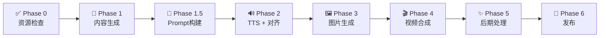

# ClawReel - AI 短视频语义对齐流水线

> **声音、字幕、画面三同步。** 图片切换时机由 TTS 逐词时间戳（~50ms）精确驱动，每张图内容由对应语句语义生成。

---

## 流程概览



| Phase | 做什么 | 产出 |
|-------|--------|------|
| **Phase 0** | 扫描已有资源，估算成本 | 资源清单 + 成本 |
| **Phase 1** | 生成口播内容，格式化并保存 | `script_*.json` |
| **Phase 1.5** | 在 script JSON 中构建生图 Prompt | 含 `image_prompts` 的 script |
| **Phase 2** | Edge TTS 配音 + 时间戳对齐 | 音频 + `segments_*.json` |
| **Phase 3** | 按 segments 生成图片/视频 | `seg_*.jpg` + 可选片头 |
| **Phase 4** | FFmpeg 合成视频 | `composed.mp4` |
| **Phase 5** | 字幕烧录 + AIGC 水印 | `final_composed.mp4` |
| **Phase 6** | 多平台发布 | 抖音/小红书 |

---

## 架构原则

| 层级 | 职责 | 边界 |
|------|------|------|
| Agent（你） | 创意决策、内容生成、Prompt 构建 | 不直接调用 API，不做格式化 |
| CLI | 格式化、TTS、配音、合成、发布 | 不理解上下文，只做执行 |
| 生图模型 | 按 Prompt 生成图片 | 无记忆，每次独立调用 |

---

## ⛔ STOP GATES

| Gate | 时机 | 展示内容 | 确认后才执行 |
|------|------|----------|-------------|
| **GATE 1** | Phase 1 完成后 | title + sentences 表格 | Phase 1.5 |
| **GATE 2** | Phase 1.5 完成后 | 全局基调 + 关键帧 Prompt 概要 | Phase 2 |
| **GATE 3** | Phase 3 完成后 | **6-8 张关键帧图片**（首帧、每段落首帧、总结帧、CTA帧） | Phase 4 |

**违规后果**：不可逆的成本浪费。

---

## 路径规范（重要）

所有 CLI 路径参数**必须使用绝对路径**，避免工作目录变化导致找不到文件。

```bash
# ✅ 正确
clawreel compose --tts /path/to/assets/tts_output.mp3 --music /path/to/assets/bg_music_default.mp3 ...

# ❌ 错误（相对路径可能在 compose 内部步骤中失效）
clawreel compose --tts assets/tts_output.mp3 --music bg_music_default.mp3 ...
```

**常用文件绝对路径**：
- 背景音乐：`/path/to/project/assets/bg_music_default.mp3`
- TTS 输出：`/path/to/project/assets/tts_output.mp3`
- 脚本文件：`/path/to/project/assets/script_<主题>_<日期>.json`
- 片段文件：`/path/to/project/assets/segments_<主题>_<日期>.json`

---

## 流程

### Phase 0: 资源检查

**做什么**：扫描 assets 目录，列出已有/缺失资源，估算生成成本。

```bash
clawreel check --topic "主题" [--llm-suggest]
```

产出：资源清单 + 成本估算 + **（加 `--llm-suggest`）LLM 复用建议**

**Agent 决策指引**：
- 已有脚本 → 可复用结构，只改内容
- 已有图片/音乐 → 评估是否匹配新主题
- 缺失资源 → 明确需要生成的项
- 成本超预期 → 先汇报，等用户确认

---

### Phase 1: 内容生成 + 格式化 + 保存

**做什么**：基于用户想法生成完整口播内容，CLI 格式化，Agent 保存为 JSON 文件。

#### Step 1: 生成口播内容

基于用户输入，生成完整的口语化脚本：
- 理解核心观点（用户表达即使模糊）
- 控制节奏：开头钩子 → 分段展开 → 总结 → CTA
- 灵活控制句数（5-30句）
- 每句一个核心信息点，便于生成独立画面

格式：用 `|` 分隔句子，`# 标题` 标注标题

**示例 — `format --content` 输入：**
```
# 猫咪为何沉迷纸箱
你有没有发现 | 每次拆快递 | 猫比你还兴奋 | 直接无视新买的玩具 | 钻进纸箱不出来了 | 科学说这跟野外习性有关 | 狭小空间让它们有安全感 | 压力大的地方待久了 | 回到纸箱就像回到洞穴 | 原来不是箱子贵 | 是这个私人领地太值钱 | 关注我带你了解喵星人的秘密
```

#### Step 2: 格式化

```bash
clawreel format --content "完整口播内容" --title "标题"
```

输出 JSON 到 stdout（**CLI 不自动保存文件**）。

#### Step 3: 保存脚本文件

将 format 输出的 JSON 保存到文件，路径格式 `assets/script_<主题>_<日期>.json`。

```bash
# 将 format 的 stdout JSON 写入文件
clawreel format --content "..." --title "标题" > /dev/null  # 先获取结构
# 然后用 Write 工具保存完整 JSON（含 sentences/hooks/cta）
```

⛔ **GATE 1** — 展示 title + sentences 表格，确认后继续。

---

### Phase 1.5: 构建生图 Prompt（关键步骤）

**做什么**：在 script JSON 中为每句话构建 `image_prompts` 数组，align 命令会读取这些 prompt。

**为什么在 Phase 2 之前**：`align --script` 会读取脚本中的 `image_prompts` 字段。如果预先构建，生成的 segments.json 就会包含正确的 prompt，无需事后回写。

#### Prompt 组装公式

每帧 Prompt 独立完整，生图模型无记忆：

```
[全局视觉基调], [视觉风格], [本帧画面描述]
```

#### Step 1: 确定全局视觉基调 + 风格（写入 script JSON 根级字段）

- `global_visual_context`：场景锚定（80-120字）— 场景、光源、氛围
- `style_prompt`：画质与构图（40-60字）— 所有帧共享

**常用风格模板**：

| 类型 | style_prompt |
|------|-------------|
| 宠物/动物 | `Cinematic 4K wildlife photography, 9:16 vertical portrait, shallow depth of field with bokeh, warm golden side-lighting, high contrast, shot on 85mm lens.` |
| 科技/数码 | `Cinematic 4K tech photography, 9:16 vertical portrait, shallow depth of field, cool blue-white studio lighting, clean modern aesthetic, high contrast.` |
| 生活/美食 | `Cinematic 4K lifestyle photography, 9:16 vertical portrait, shallow depth of field, warm natural window light, cozy atmosphere, food magazine quality.` |

#### Step 2: 为每句构建逐帧 Prompt（写入 `image_prompts` 数组）

Prompt **用英文**，生图模型理解更好。每帧 50-80 字，描述具体画面。

**批量构建策略**：按段落分组，每组共用场景和角色，只变化动作/表情。

**示例 — 鹦鹉视频 7 句虎皮段落的 Prompt 模式**：

```
Frame 1: [风格]. Budgerigar star entrance: a vibrant green-yellow budgie perched proudly on a natural branch, bright curious eyes looking at camera, spotlight effect.
Frame 2: [风格]. Budgie in cozy home: sitting on owner's finger in warm living room, beginner-friendly atmosphere.
Frame 3: [风格]. Pet shop scene: multiple budgies in cage, price tag in foreground, affordable feel.
Frame 4: [风格]. Color explosion: five budgies in different color mutations perched together, rainbow display.
Frame 5: [风格]. Tiny budgie in cupped hands, showing small delicate size, endearing expression.
Frame 6: [风格]. Talking budgie: blue budgie with beak open mid-speech on owner's shoulder.
Frame 7: [风格]. Smart budgie on mini chalkboard with scattered characters, intelligent focused gaze.
```

#### Step 3: 写入 script JSON

在 script JSON 中添加三个字段：

```json
{
  "title": "...",
  "script": "...",
  "sentences": [...],
  "hooks": [...],
  "cta": "...",
  "global_visual_context": "Warm indoor pet bird photography setting, natural golden sunlight, wooden perches, vivid feather details.",
  "style_prompt": "Cinematic 4K wildlife photography, 9:16 vertical portrait, shallow depth of field, warm golden side-lighting.",
  "image_prompts": [
    "Cinematic 4K..., Warm indoor..., Title card: bold text, three parrot silhouettes, magazine cover layout.",
    "Cinematic 4K..., Warm indoor..., Budgerigar star entrance: vibrant green-yellow budgie, spotlight effect.",
    "...(每句一个 prompt)"
  ]
}
```

⚠️ **关键**：`image_prompts` 数组长度必须等于 `sentences` 数组长度，一一对应。

⛔ **GATE 2** — 展示全局基调 + 段落 Prompt 概要表格，确认后继续。

---

### Phase 2: TTS + 对齐

**做什么**：Edge TTS 生成配音，逐词时间戳驱动图片切换。align 会读取 script 中的 `image_prompts`。

```bash
clawreel align \
  --text "脚本文本（不含标题，空格分隔）" \
  --script /abs/path/assets/script_<主题>_<日期>.json \
  --output /abs/path/assets/segments_<主题>_<日期>.json \
  [--split-long]
```

**注意**：
- `--text`：用空格分隔各句（非 `|`），不含标题行的 `#`
- `--script`：指向 Phase 1 保存的 script JSON（align 从中读取 hooks、image_prompts）
- `--output`：输出的 segments 文件路径

产出：`assets/tts_output.mp3` + `assets/segments_<主题>_<日期>.json`

| Provider | 成本 | 时间戳 |
|----------|------|--------|
| `edge` | 免费 | ✅ 逐词（~50ms）|
| `minimax` | 付费 | ❌ 不支持 |

---

### Phase 3: 图片生成

**做什么**：按 segments.json 批量生成图片，可选生成 6 秒片头视频。

```bash
clawreel assets --segments /abs/path/assets/segments_<主题>_<日期>.json [--video]
```

产出：`assets/images/seg_*.jpg`

⛔ **GATE 3** — 展示 **6-8 张关键帧**（首帧、每段落首帧、总结帧、CTA帧），确认后继续。

---

### Phase 4: 视频合成

**做什么**：FFmpeg 按 segments 时长精确拼接图片 + 配音 + 背景音乐。

```bash
clawreel compose \
  --tts /abs/path/assets/tts_output.mp3 \
  --segments /abs/path/assets/segments_<主题>_<日期>.json \
  --music /abs/path/assets/bg_music_default.mp3 \
  [--hook-video PATH]
```

产出：`output/composed.mp4`

**常见失败与恢复**：

| 失败现象 | 原因 | 恢复方法 |
|----------|------|---------|
| `bg_music: No such file` | 路径不是绝对路径 | 使用 `assets/bg_music_default.mp3` 的绝对路径 |
| exit code 254 (OOM) | 30+ 帧 xfade 消耗内存 | body_xfade.mp4 已生成，手动合并音频即可 |

**手动合并音频（compose 失败时的降级方案）**：

```bash
ffmpeg -y \
  -i /abs/path/assets/body_xfade.mp4 \
  -i /abs/path/assets/tts_output.mp3 \
  -i /abs/path/assets/bg_music_default.mp3 \
  -filter_complex "[2:a]volume=0.15[bg];[1:a][bg]amix=inputs=2:duration=first:dropout_transition=2,aresample=44100" \
  -c:v libx264 -preset fast -crf 23 -pix_fmt yuv420p -b:v 6M \
  -c:a aac -b:a 128000 -ar 44100 \
  -t <视频时长> \
  /abs/path/output/composed.mp4
```

---

### Phase 5: 后期处理

**做什么**：烧录 SRT 字幕（Whisper 自动提取），添加 AIGC 水印标识。

```bash
clawreel post --video /abs/path/output/composed.mp4 --title "标题" [--font-size 16]
```

产出：`output/final_composed.mp4`

---

### Phase 6: 发布

**做什么**：一键发布到抖音/小红书。

```bash
clawreel publish --video /abs/path/output/final_composed.mp4 --title "标题" --platforms douyin xiaohongshu
```

---

## 封面首图

用户可能指定某张图片作为视频封面/首图。处理方式：

1. 记录用户指定的图片编号（如 seg_006）
2. Phase 4 compose 后，该帧已包含在视频中
3. 发布时可用该帧作为封面图（抖音支持自定义封面）

---

## 错误处理

| 场景 | 处理 |
|------|------|
| 用户中断 | 保留当前阶段产物，下次从断点继续 |
| API 调用失败 | 重试 3 次，间隔指数退避；仍失败则展示错误并等待指令 |
| compose 路径失败 | 检查是否使用了绝对路径，降级为手动 ffmpeg 合并 |
| 资源文件缺失 | 明确指出缺失文件，指导用户补充或跳过 |
| 成本超预期 | 立即暂停，汇报实际成本，等待确认 |

---

## 文件约定

| 类型 | 路径 |
|------|------|
| 脚本 | `assets/script_<主题>_<日期>.json` |
| 片段 | `assets/segments_<主题>_<日期>.json` |
| 图片 | `assets/images/seg_*.jpg` |
| 背景音乐 | `assets/bg_music_default.mp3` |
| TTS 音频 | `assets/tts_output.mp3` |
| 合成视频 | `output/composed.mp4` |
| 最终视频 | `output/final_composed.mp4` |

---

## 命令速查

```bash
# Phase 0: 资源检查
clawreel check --topic "主题"

# Phase 1: 格式化（输出到 stdout，需手动保存）
clawreel format --content "内容 | 用|分隔" --title "标题"

# Phase 2: TTS + 对齐（读取 script 中的 image_prompts）
clawreel align --text "空格分隔的文本" --script /abs/script.json --output /abs/segments.json

# Phase 3: 图片生成
clawreel assets --segments /abs/segments.json

# Phase 4: 视频合成（⚠️ 必须用绝对路径）
clawreel compose --tts /abs/tts.mp3 --segments /abs/segments.json --music /abs/music.mp3

# Phase 5: 后期处理
clawreel post --video /abs/composed.mp4 --title "标题"

# Phase 6: 发布
clawreel publish --video /abs/final.mp4 --title "标题" --platforms douyin xiaohongshu
```
