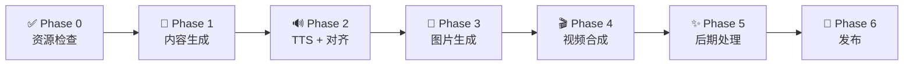

# ClawReel - AI 短视频语义对齐流水线

> **声音、字幕、画面三同步。** 图片切换时机由 TTS 逐词时间戳（~50ms）精确驱动，每张图内容由对应语句语义生成。

---

## 流程概览



| Phase | 做什么 | 产出 |
|-------|--------|------|
| **Phase 0** | 扫描已有资源，估算成本 | 资源清单 + 成本 |
| **Phase 1** | 生成口播内容，格式化 | 标准 JSON |
| **Phase 1.5** | 构建生图 Prompt | 分层 Prompt |
| **Phase 2** | Edge TTS 配音 + 时间戳对齐 | 音频 + segments.json |
| **Phase 3** | 按 segments 生成图片/视频 | 图片 + 可选片头 |
| **Phase 4** | FFmpeg 合成视频 | composed.mp4 |
| **Phase 5** | 字幕烧录 + AIGC 水印 | final.mp4 |
| **Phase 6** | 多平台发布 | 抖音/小红书 |

---

## 架构原则

| 层级 | 职责 | 边界 |
|------|------|------|
| Agent（你） | 创意决策、内容生成、Prompt 构建 | 不直接调用 API，不做格式化 |
| CLI | 格式化、TTS、配音、合成、发布 | 不理解上下文，只做执行 |
| 生图模型 | 按 Prompt 生成图片 | 无记忆，每次独立调用 |

---

## ⛔ STOP GATES

| Gate | 时机 | 行动 |
|------|------|------|
| **GATE 1** | format 完成后 | 展示 title + sentences → 等待用户确认 |
| **GATE 2** | Prompt 构建完成后 | 展示所有 Prompt → 等待用户确认 |
| **GATE 3** | assets 生成完成后 | 展示所有图片 → 等待用户确认 |

**违规后果**：不可逆的成本浪费。

---

## 流程

### Phase 0: 资源检查

**做什么**：扫描 assets 目录，列出已有/缺失资源，估算生成成本。

```bash
clawreel check --topic "主题" [--llm-suggest]
```

产出：资源清单 + 成本估算 + **（加 `--llm-suggest`）LLM 复用建议**

**Agent 决策指引**：
- 已有脚本 → 可复用结构，只改内容
- 已有图片/音乐 → 评估是否匹配新主题
- 缺失资源 → 明确需要生成的项
- 成本超预期 → 先汇报，等用户确认

---

### Phase 1: 内容生成 + 格式化

**做什么**：基于用户想法生成完整口播内容，CLI 格式化为标准 JSON。

**Step 1: 生成口播内容**

基于用户输入，生成完整的口语化脚本：
- 理解核心观点（用户表达即使模糊）
- 控制节奏：开头钩子 → 痛点 → 案例 → 情感 → CTA
- 灵活控制句数（5-25句）

格式：用 `|` 分隔句子，`# 标题` 标注标题

**示例 — `format --content` 输入：**
```
# 猫咪为何沉迷纸箱
你有没有发现 | 每次拆快递 | 猫比你还兴奋 | 直接无视新买的玩具 | 钻进纸箱不出来了 | 科学说这跟野外习性有关 | 狭小空间让它们有安全感 | 压力大的地方待久了 | 回到纸箱就像回到洞穴 | 原来不是箱子贵 | 是这个私人领地太值钱 | 关注我带你了解喵星人的秘密
```

**Step 2: 格式化**

```bash
clawreel format --content "完整口播内容" --title "标题"
```

输出：
```json
{
  "title": "标题",
  "script": "句1 | 句2 | ...",
  "sentences": ["句1", "句2", ...],
  "hooks": ["钩子1", "钩子2"],
  "cta": "关注我带你避坑"
}
```

⛔ **GATE 1** — 展示结果，确认后继续。

---

### Phase 1.5: 构建生图 Prompt

**做什么**：为每个 segment 构建分层 Prompt，注入完整视觉上下文。

生图模型无记忆。每次调用需注入完整上下文。

**Prompt 组装公式：**
```
[全局视觉基调], [视觉风格], [帧序号], [本帧画面描述]
```

#### 1. 全局视觉基调（80-120字）

角色与场景锚定：
- 人物特征（年龄、发型、服装、体型）
- 场景细节（陈设、光源、道具）
- 人物与场景的关系

#### 2. 视觉风格（40-60字）

所有帧共享，画质与构图：
```
电影级4K画质，9:16竖屏构图，浅景深虚化背景，侧逆光勾勒轮廓，高对比度。
```

#### 3. 逐帧画面描述（50-80字/帧）

动作/表情/变化，不重复全局信息：
```
Frame 1/11: 他双手放在键盘上，眉头紧锁，盯着屏幕上密密麻麻的报错日志，表情从期待变为失望。
Frame 2/11: 他无奈地靠回椅背，双手抱胸，显示器上弹出一个醒目的红色限流报错弹窗。
...
```

#### 4. 写入 segments.json

将完整 Prompt 写入每帧的 `image_prompt` 字段。

⛔ **GATE 2** — 展示所有 Prompt，确认后继续。

---

### Phase 2: TTS + 对齐

**做什么**：Edge TTS 生成配音，逐词时间戳驱动图片切换。

```bash
clawreel align --text "脚本文本" --script PATH --output PATH [--split-long]
```

产出：`tts_output.mp3` + `segments_xxx.json`（含逐词时间戳）

| Provider | 成本 | 时间戳 |
|----------|------|--------|
| `edge` | 免费 | ✅ 逐词（~50ms）|
| `minimax` | 付费 | ❌ 不支持 |

---

### Phase 3: 图片生成

**做什么**：按 segments.json 批量生成图片，可选生成 6 秒片头视频。

```bash
clawreel assets --segments PATH [--video]
```

产出：`assets/images/seg_*.jpg`

⛔ **GATE 3** — 展示所有图片，确认后继续。

---

### Phase 4: 视频合成

**做什么**：FFmpeg 按 segments 时长精确拼接图片 + 配音 + 背景音乐。

```bash
clawreel compose --tts PATH --segments PATH --music PATH [--hook-video PATH]
```

产出：`output/composed.mp4`

---

### Phase 5: 后期处理

**做什么**：烧录 SRT 字幕，添加 AIGC 水印标识。

```bash
clawreel post --video PATH --title "标题" [--font-size 16]
```

---

### Phase 6: 发布

**做什么**：一键发布到抖音/小红书。

```bash
clawreel publish --video PATH --title "标题" --platforms douyin xiaohongshu
```

---

## 错误处理

| 场景 | 处理 |
|------|------|
| 用户中断 | 保留当前阶段产物，下次从断点继续 |
| API 调用失败 | 重试 3 次，间隔指数退避；仍失败则展示错误并等待指令 |
| 资源文件缺失 | 明确指出缺失文件，指导用户补充或跳过 |
| 成本超预期 | 立即暂停，汇报实际成本，等待确认 |

---

## 文件约定

| 类型 | 路径 |
|------|------|
| 脚本 | `assets/script_<主题>_<日期>.json` |
| 片段 | `assets/segments_<主题>_<日期>.json` |
| 图片 | `assets/images/seg_*.jpg` |
| 视频 | `output/composed.mp4` → `output/final.mp4` |

---

## 命令速查

```bash
clawreel check --topic "主题"                        # Phase 0
clawreel format --content "内容" --title "标题"      # Phase 1
clawreel align --text "文本" --script PATH --output PATH [--split-long]  # Phase 2
clawreel assets --segments PATH [--video]            # Phase 3
clawreel compose --tts PATH --segments PATH --music PATH [--hook-video PATH]  # Phase 4
clawreel post --video PATH --title "标题"            # Phase 5
clawreel publish --video PATH --title "标题" --platforms douyin xiaohongshu  # Phase 6
```
